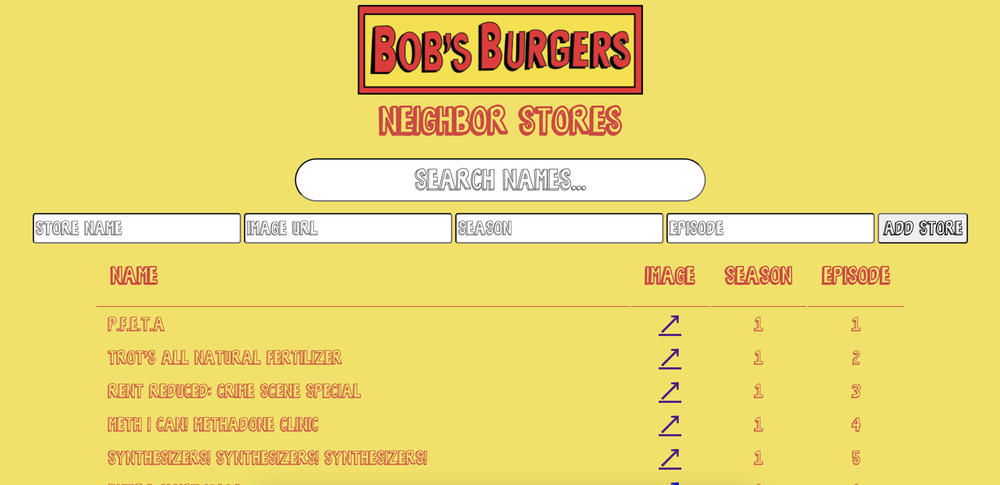

# Bob's Burgers Neighbors

Being a huge fan of Bob's Burgers you've decided to develop a new app that allows you to track all the punny names of the businesses that are next door to Bob's restaurant during the opening sequence.

Being a creative type, you've also given yourself a way to add _new_ punny business names that have yet to be developed!

## Instructions

For this project, you’ll be building out a React application that displays a
list of businesses in Bob's Burgers, among other features.

Part of what this code challenge is testing is your ability to follow given
instructions. While you will definitely have a significant amount of freedom in
how you implement the features, be sure to carefully read the directions for
setting up the application.

## Setup

After unbundling the project:

1. Run `npm install` in your terminal.
2. Run `npm run server`. This will run your backend on port `8085`.
3. In a new terminal, run `npm start`.

Make sure to open
[http://localhost:8085/stores](http://localhost:8085/stores) in the
browser to verify that your backend is working before you proceed!

If you are unfamiliar with HTML tables, take a look at the
[docs with an example here](https://www.w3schools.com/html/html_tables.asp)

## Endpoints

The base URL for your backend is: `http://localhost:8085`

## Core Deliverables

As a user, I should be able to:

- See a table of the next door store names from Bob's Burgers.
- Fill out and submit the form to add a new store. This should add the new store to the table **as well as post the new store to the backend API for persistence**.
- Filter stores by typing into the search bar. Only stores with a name matching the search term should be store in the table.